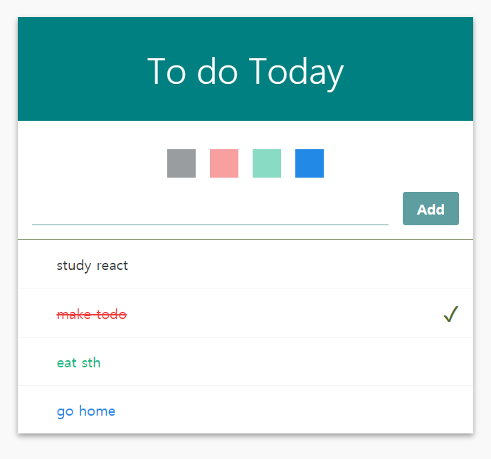
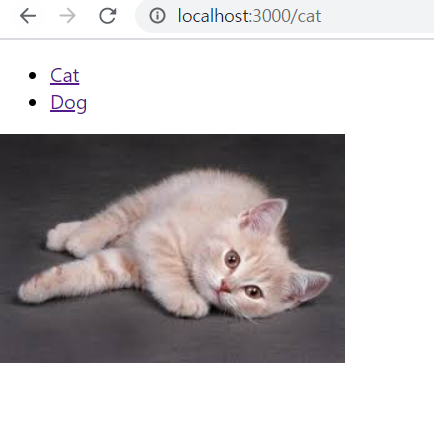

```bash
yarn global add create-react-app

# typescript 설치
yarn add typescript

# 프로젝트 생성
create-react-app todo-list

# 서버 실행
yarn start
```


## 1. TODO 만들기



- todo list 위에 palette 를 통해서 글자의 색을 변할 수 있도록함
- 마무리한 일은 체크 표시
- 커서를 item 위에 두면 삭제 표시가 나타나 각 목록을 삭제할 수 있도록 생성


## 2. Routes



- `npm install react-router-dom` 
  - route 설치
- Dog 와 Cat 누르면 `/<url>` 로 들어가 이미지 표시